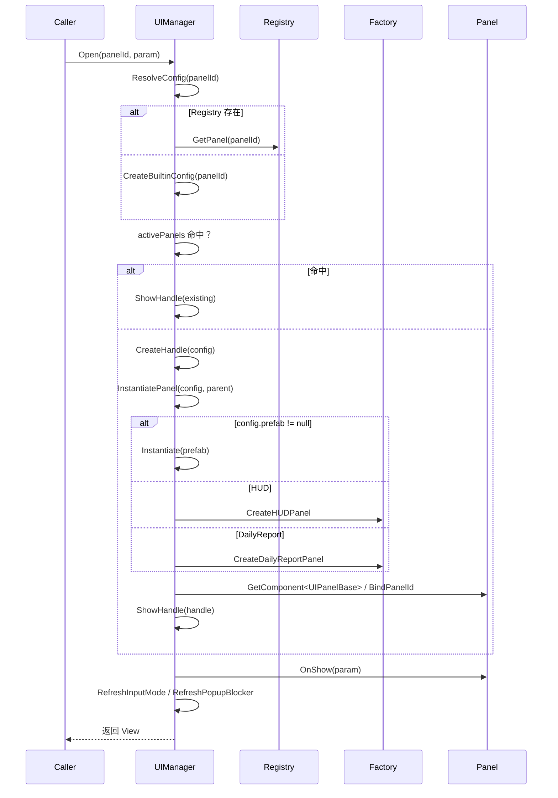

# UI 加载框架（hotel_unity）

> 本文档聚焦 UI 加载、生命周期管理与输入互斥机制，对应 `UIManager` 及其周边实现。第一阶段已落地 HUD + Popup 最小框架。

---

## 1. 核心职责

UI 加载框架负责：

- 面板的按需实例化（Prefab 或运行时生成）
- 层级管理（HUD / Popup）
- 缓存策略（`cacheOnClose`）
- Popup 栈与 Esc 关闭
- 输入模式切换（与摆放/相机互斥）
- 生命周期事件（`OnShow` / `OnClose` / `OnRefresh`）

---

## 2. 主要类与职责

| 类                        | 位置                              | 职责 |
|---------------------------|-----------------------------------|------|
| `UIManager`               | `Assets/script/UI/UIManager.cs`   | 单例，Open/Close/Refresh，层级自动创建，输入模式管理 |
| `UIPanelConfig`           | `Assets/script/UI/Data/UIPanelConfig.cs` | ScriptableObject，定义 panelId、prefab、layer、cache、pauseGameplay |
| `UIPanelRegistry`         | `Assets/script/UI/Data/UIPanelRegistry.cs` | SO 注册表，提供 panelId → Config 快速查找 |
| `UIPanelBase`             | `Assets/script/UI/Core/UIPanelBase.cs` | 所有面板基类，声明 OnShow/OnClose/OnRefresh |
| `UIPanelHandle`           | `Assets/script/UI/Core/UIPanelHandle.cs` | 运行时实例句柄（Instance + View + Config） |
| `UIPanelRuntimeFactory`   | `Assets/script/UI/UIPanelRuntimeFactory.cs` | 无 Prefab 时生成最小 HUD / DailyReport 结构 |
| `GameInputGate`           | `Assets/script/UI/GameInputGate.cs` | 静态查询 `AllowsWorldInput` |
| `GameInputMode`           | `Assets/script/UI/Core/GameInputMode.cs` | World / UIOnly / Blocked 枚举 |
| `UILayer`                 | `Assets/script/UI/Core/UILayer.cs` | Background / HUD / Normal / Popup / Top |

---

## 3. 加载流程（Open / Show）



**关键步骤**：

1. `ResolveConfig`：Registry 优先，否则内置配置（HUD/Popup）。
2. 已存在实例 → 直接 `ShowHandle`（SetActive + OnShow）。
3. 新建：`CreateHandle` → `InstantiatePanel`（Prefab 或 RuntimeFactory）→ 获取/添加 `UIPanelBase` → `BindPanelId`。
4. `ShowHandle`：激活、调用生命周期、入 Popup 栈、切换输入模式、触发 `OnPanelOpened` 事件。

---

## 4. 关闭与缓存

- `Close(panelId)`：
  - 调用 `OnClose()`
  - `cacheOnClose == true` → `SetActive(false)` + `IsVisible=false`（保留实例）
  - 否则 `Destroy` 并从 `activePanels` 移除
- Popup 关闭后自动 `RemoveFromPopupStack`
- `TryCloseTopPopup`：Esc 优先关闭栈顶 Popup

---

## 5. 内置面板 ID 与默认配置

| panelId       | Layer     | pauseGameplay | cacheOnClose | blockInputBelow | 说明 |
|---------------|-----------|---------------|--------------|-----------------|------|
| `HUD`         | HUD       | false         | true         | false           | 常驻信息（银两、满意度） |
| `DailyReport` | Popup     | true          | true         | true            | 日结弹窗 |

无 Registry 时由 `CreateBuiltinConfig` 自动生成对应配置。

---

## 6. 运行时 UI 生成（RuntimeFactory）

当 `config.prefab == null` 时：

- `HUD` → `CreateHUDPanel`：生成 `HUDPanel` + 两个 Text（Silver / Satisfaction）
- `DailyReport` → `CreateDailyReportPanel`：生成半透明背景 + 标题 + 5 行数据 + 关闭按钮 + `DailyReportPanel`

生成结构使用 `RectTransform` + `Image` + `Text` / `Button`，锚点与布局在工厂方法内硬编码。

---

## 7. 输入互斥机制

1. Popup 打开且 `pauseGameplay=true` → `InputMode = UIOnly`
2. `GameInputGate.AllowsWorldInput` 返回 `UIManager.Instance == null || InputMode == World`
3. `FurniturePlacer`、`PlacementPreview`、`CameraController` 在 `!AllowsWorldInput` 时跳过射线/输入处理
4. Esc 流程：`TryCloseTopPopup` → 无 Popup 时才允许摆放取消逻辑

---

## 8. 事件与扩展点

- `UIManager.OnPanelOpened / OnPanelClosed`：外部可订阅（例如暂停/恢复日循环）
- `UIPanelBase.RequestClose()`：子面板内部请求关闭自身
- 未来扩展：Addressables 异步加载、转场动画、对象池、多 Layer 完整支持

---

## 9. 使用示例

```csharp
// 打开日结
UIManager.Instance.Open(UIManager.PanelDailyReport, new DailyReportData(day, income, expense, satisfaction));

// 刷新 HUD
UIManager.Instance.Refresh(UIManager.PanelHUD, new HUDData(silver, satisfactionValue));

// 关闭
UIManager.Instance.Close(UIManager.PanelDailyReport);

// 查询
if (UIManager.Instance.HasOpenPopup()) { ... }
```

---

## 10. 注意事项与现状

- **文件重复**：`Assets/Script/UI/` 与 `Assets/script/UI/` 存在大量重复文件，建议统一目录。
- **生命周期命名**：`UIPanelBase` 使用 `OnShow`，但代码生成器产出的 `MainScreenPanelBase` 使用 `OnOpen`，存在不一致风险。
- **MainScreenPanel**：已通过生成器创建，但尚未完全接入 UIManager 流程（仍处 TODO）。
- 推荐阅读：`doc/ui-system.md`（完整三阶段规划）。

---

**维护建议**：每次修改 `UIManager` 或新增面板时同步更新本文档与 `ui-system.md`。