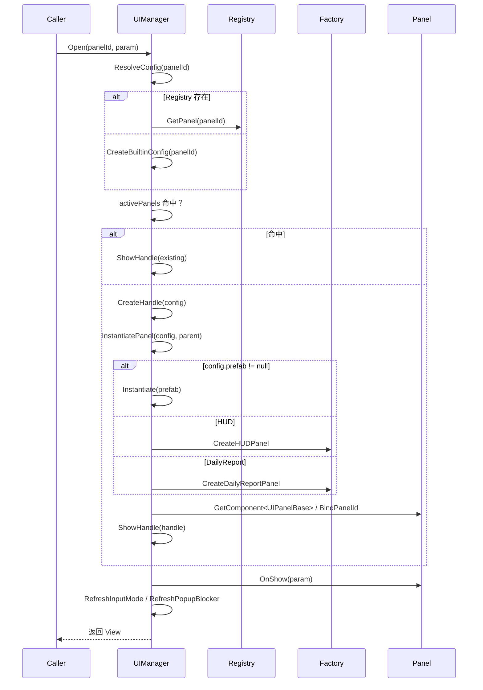

# UI 管理系统设计（hotel_unity）

> 与摆放系统并列的 UI 生命周期模块，涵盖**设计规划**与**加载框架实现**。第一阶段已在 v0.2 前落地骨架；后续阶段按版本迭代扩展。

---

## 架构概览

```
UIPanelRegistry (SO)     ──►  panelId → UIPanelConfig
UIPanelConfig (SO)       ──►  prefab / layer / cache / 输入互斥
UIManager (MonoBehaviour)──►  Open / Close / Refresh / Popup 栈
UIPanelBase              ──►  各面板 OnOpen / OnClose / OnRefresh
GameInputGate            ──►  摆放/相机/预览查询 AllowsWorldInput
```

### 主要类与职责

| 类 | 位置 | 职责 |
| :--- | :--- | :--- |
| `UIManager` | `Assets/script/UI/UIManager.cs` | 单例，Open/Close/Refresh，层级自动创建，输入模式管理 |
| `UIPanelConfig` | `Assets/script/UI/Data/UIPanelConfig.cs` | ScriptableObject，定义 panelId、prefab、layer、cache、pauseGameplay |
| `UIPanelRegistry` | `Assets/script/UI/Data/UIPanelRegistry.cs` | SO 注册表，提供 panelId → Config 快速查找 |
| `UIPanelBase` | `Assets/script/UI/Core/UIPanelBase.cs` | 所有面板基类，声明 OnShow/OnClose/OnRefresh |
| `UIPanelHandle` | `Assets/script/UI/Core/UIPanelHandle.cs` | 运行时实例句柄（Instance + View + Config） |
| `UIPanelRuntimeFactory` | `Assets/script/UI/UIPanelRuntimeFactory.cs` | 无 Prefab 时生成最小 HUD / DailyReport 结构 |
| `GameInputGate` | `Assets/script/UI/GameInputGate.cs` | 静态查询 `AllowsWorldInput` |
| `GameInputMode` | `Assets/script/UI/Core/GameInputMode.cs` | World / UIOnly / Blocked 枚举 |
| `UILayer` | `Assets/script/UI/Core/UILayer.cs` | Background / HUD / Normal / Popup / Top |

### 目录

```
Assets/script/UI/
├── Core/          UILayer, GameInputMode, UIPanelBase, UIPanelHandle
├── Data/          UIPanelConfig, UIPanelRegistry, HUDData, DailyReportData
├── Panels/        HUDPanel, DailyReportPanel
├── UIManager.cs
├── UIPanelRuntimeFactory.cs   # 无 Prefab 时生成最小 UI
├── GameInputGate.cs
└── UIDemoController.cs        # F1 刷新 HUD / F2 打开日结（开发用）
```

### Canvas 层级（完整规划）

| UILayer | Sort 意图 | 第一阶段 | 典型用途 |
| :--- | :--- | :--- | :--- |
| Background | 0 | 未启用 | 全屏背景、场景内嵌 UI |
| HUD | 50 | **已启用** | 银两、满意度、常驻信息 |
| Normal | 100 | 未启用 | 侧边栏、风闻簿常驻页 |
| Popup | 200 | **已启用** | 日结、商店、招聘弹窗 |
| Top | 300 | 未启用 | Toast、加载遮罩 |

---

## 面板生命周期与加载流程（Open / Show）



**关键步骤**：

1. `ResolveConfig`：Registry 优先，否则内置配置（HUD/Popup）。
2. 已存在实例 → 直接 `ShowHandle`（SetActive + OnShow）。
3. 新建：`CreateHandle` → `InstantiatePanel`（Prefab 或 RuntimeFactory）→ 获取/添加 `UIPanelBase` → `BindPanelId`。
4. `ShowHandle`：激活、调用生命周期、入 Popup 栈、切换输入模式、触发 `OnPanelOpened` 事件。

---

## 关闭与缓存策略

- `Close(panelId)`：
  - 调用 `OnClose()`
  - `cacheOnClose == true` → `SetActive(false)` + `IsVisible=false`（保留实例）
  - 否则 `Destroy` 并从 `activePanels` 移除
- Popup 关闭后自动 `RemoveFromPopupStack`
- `TryCloseTopPopup`：Esc 优先关闭栈顶 Popup

---

## 运行时 UI 生成（RuntimeFactory）

当 `config.prefab == null` 时：

- `HUD` → `CreateHUDPanel`：生成 `HUDPanel` + 两个 Text（Silver / Satisfaction）
- `DailyReport` → `CreateDailyReportPanel`：生成半透明背景 + 标题 + 5 行数据 + 关闭按钮 + `DailyReportPanel`

生成结构使用 `RectTransform` + `Image` + `Text` / `Button`，锚点与布局在工厂方法内硬编码。

---

## 输入互斥机制

1. Popup 打开且 `pauseGameplay=true` → `InputMode = UIOnly`
2. `GameInputGate.AllowsWorldInput` 返回 `UIManager.Instance == null || InputMode == World`
3. `FurniturePlacer`、`PlacementPreview`、`CameraController` 在 `!AllowsWorldInput` 时跳过射线/输入处理
4. Esc 流程：`TryCloseTopPopup` → 无 Popup 时才允许摆放取消逻辑

---

## 事件与扩展点

- `UIManager.OnPanelOpened / OnPanelClosed`：外部可订阅（例如暂停/恢复日循环）
- `UIPanelBase.RequestClose()`：子面板内部请求关闭自身
- 未来扩展：Addressables 异步加载、转场动画、对象池、多 Layer 完整支持

---

## 使用示例

```csharp
// 打开日结
UIManager.Instance.Open(UIManager.PanelDailyReport, new DailyReportData(day, income, expense, satisfaction));

// 刷新 HUD
UIManager.Instance.Refresh(UIManager.PanelHUD, new HUDData(silver, satisfactionValue));

// 关闭
UIManager.Instance.Close(UIManager.PanelDailyReport);

// 查询
if (UIManager.Instance.HasOpenPopup()) { ... }
```

---

## 第一阶段（已实现）

**目标**：HUD + 日结 Popup 的最小可用框架，与摆放/相机输入互斥。

### 已实现能力

- [x] `UIManager`：`Open` / `Close` / `Refresh` / `CloseAll` / `TryCloseTopPopup`
- [x] `UIPanelConfig` + `UIPanelRegistry`（无 Registry 时使用内置 HUD/日结配置）
- [x] `UIPanelBase` 生命周期：`OnOpen` / `OnClose` / `OnRefresh`
- [x] 两层节点：`HUDLayer` + `PopupLayer` + Popup 遮罩
- [x] `cacheOnClose`：关闭时 Hide 而非 Destroy（HUD、日结默认缓存）
- [x] `GameInputMode`：`pauseGameplay=true` 的面板打开时切换为 `UIOnly`
- [x] `GameInputGate`：`FurniturePlacer` / `PlacementPreview` / `CameraController` 已接入
- [x] Esc：优先关闭顶层 Popup；无 Popup 时再取消拖拽/预览
- [x] 内置面板：`HUDPanel`、`DailyReportPanel`（无 Prefab 时运行时生成）
- [x] `UIDemoController`：F1 刷新 HUD，F2 打开日结（演示数据）

### 场景接入

1. 在场景中创建空物体，挂载 `UIManager`（可选挂 `UIDemoController`）。
2. （可选）创建 `UIPanelRegistry` SO，填入 `HUD` / `DailyReport` 的 `UIPanelConfig` 与 Prefab。
3. 运行后 HUD 自动打开；经营系统就绪后调用：

```csharp
UIManager.Instance.Refresh(UIManager.PanelHUD, new HUDData(silver, satisfaction));
UIManager.Instance.Open(UIManager.PanelDailyReport, new DailyReportData(day, income, expense, satisfaction));
```

### 面板 ID 与默认配置

无 Registry 时由 `CreateBuiltinConfig` 自动生成对应配置。

| panelId | Layer | pauseGameplay | cacheOnClose | blockInputBelow | 说明 |
| :--- | :--- | :--- | :--- | :--- | :--- |
| `HUD` | HUD | false | true | false | 常驻信息（银两、满意度），与摆放并存 |
| `DailyReport` | Popup | true | true | true | 日结弹窗，挡输入 |

---

## 第二阶段（v0.3–v0.4 预估）

**目标**：完整 Layer + 与摆放/预览深度互斥；商店等高频面板。

### 计划扩展

- [ ] 启用 `Background` / `Normal` / `Top` 层节点与 Sort Order 策略
- [ ] Popup 栈完善：非栈顶 Close、CloseAllPopup
- [ ] 按面板配置 `cacheOnClose`（低频大面板 Destroy）
- [ ] `FurnitureShop` 面板 + 对接 `PlacementPreview.StartPlacement`
- [ ] `ManualServicePanel`（v0.2 手动 fallback UI 正式化）
- [ ] `UIManager.OnPanelOpened/Closed` 订阅方：暂停/恢复日循环
- [ ] 可选：EventSystem 与 UI Layer 射线分区（避免点 UI 触发家具射线）

### 新增 panelId（预估）

| panelId | Layer | 首现版本 |
| :--- | :--- | :--- |
| `ManualService` | Popup | v0.2 |
| `FurnitureShop` | Popup | v0.4 |
| `RumorBook` | Normal | v0.3 |

---

## 第三阶段（v0.5–v1.0 预估）

**目标**：内容面板增多后的性能与体验。

### 计划扩展

- [ ] Addressables 异步加载（接口与 `Open` 保持不变）
- [ ] `Top` 层：Toast、`LoadingOverlay`
- [ ] 面板转场（淡入淡出 / 缩放，可选 DOTween）
- [ ] 对象池：高频 Instantiate 的面板（如订单气泡）
- [ ] 设置、夜间阶段、势力/对手情报等大面板 `cacheOnClose=false`
- [ ] 与存档分离：UI 不持久化，仅展示 `EconomyService` / `DayCycleService` 数据

### 新增 panelId（预估）

| panelId | Layer | 首现版本 |
| :--- | :--- | :--- |
| `FactionStatus` | HUD/Normal | v0.5 |
| `OpponentIntel` | Popup | v0.5 |
| `NightPhase` | Popup | v1.0 |
| `Settings` | Popup | v1.0 |

---

## 现状与注意事项

- **文件目录**：`Assets/Script/UI/` 与 `Assets/script/UI/` 存在重复文件，建议后续统一目录（注意大小写）。
- **生命周期命名**：`UIPanelBase` 使用 `OnShow`，但代码生成器产出的 `MainScreenPanelBase` 使用 `OnOpen`，存在不一致风险，需统一。
- **MainScreenPanel**：已通过生成器创建，但尚未完全接入 `UIManager` 流程（`OnShow` / `OnRefresh` / `OnClose` 仍为 TODO）。
- **维护**：每次修改 `UIManager` 或新增面板时同步更新本文档。

---

## 设计原则（与 AGENTS.md 一致）

1. **ScriptableObject 只存配置**，打开/关闭逻辑只在 `UIManager` 与 `UIPanelBase` 子类。
2. **`panelId` 稳定**，与 `furnitureId` 同级，改名需迁移说明。
3. **每个 Open 必须有对称 Close**，避免孤儿实例。
4. **经营规则不进 UI**：面板只展示/转发操作，数据由后续 Service 提供。
5. **不改变布局不变式**：UI 模块不直接改网格占用与 `LayoutSaver` 数据。

---

## 参考

- 版本排期：[TimeLine.md](TimeLine.md)
- 工程约定：[AGENTS.md](../AGENTS.md)
